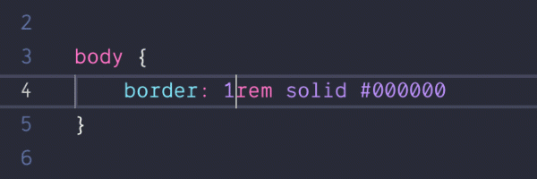
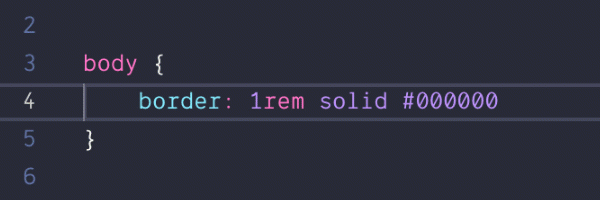
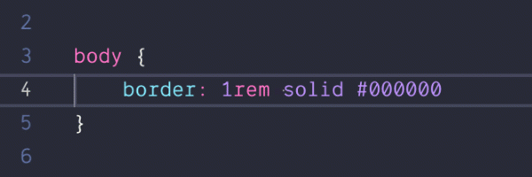
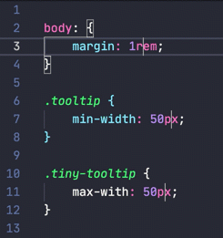

<!-- TODO: Redo all of the demo GIFs -->

<p align="center">
    <br>
    
</p>

# **Incrementor**

[](https://github.com/nmsmith22389/vscode-incrementor)

[](https://marketplace.visualstudio.com/items?itemName=nmsmith89.incrementor)&nbsp;&nbsp;
[](https://marketplace.visualstudio.com/items?itemName=nmsmith89.incrementor)&nbsp;&nbsp;
[](https://marketplace.visualstudio.com/items?itemName=nmsmith89.incrementor)&nbsp;&nbsp;
[](https://travis-ci.com/nmsmith22389/vscode-incrementor)&nbsp;&nbsp;


---

A Visual Studio Code extension that enables advanced increment / decrement actions for numbers, enumerators, or just about anything else!



## Contents
*(if you are reading this on the VSCode Marketplace then these links don't work for some reason)*
- [Features](#features)
    - [Numbers](#numbers)
    - [Enumerators](#enumerators)
    - [Multiple Selections](#multiple-selections)
- [Usage](#usage)
    - [Example](#example)
    - [Available Commands](#available-commands)
- [Extension Settings](#extension-settings)
    - [`incrementor.enabled`](#incrementorenabled)
    - [`incrementor.numbers.ones.incrementValue`](#incrementornumbersonesincrementvalue)
    - [`incrementor.numbers.ones.decrementValue`](#incrementornumbersonesdecrementvalue)
    - [`incrementor.numbers.tenths.incrementValue`](#incrementornumberstenthsincrementvalue)
    - [`incrementor.numbers.tenths.decrementValue`](#incrementornumberstenthsdecrementvalue)
    - [`incrementor.numbers.tens.incrementValue`](#incrementornumberstensincrementvalue)
    - [`incrementor.numbers.tens.decrementValue`](#incrementornumberstensdecrementvalue)
    - [`incrementor.numbers.decimalPlaces`](#incrementornumbersdecimalplaces)
    - [`incrementor.enums.loop`](#incrementorenumsloop)
    - [`incrementor.enums.values`](#incrementorenumsvalues)
    - [Keybindings](#keybindings)
- [Known Issues](#known-issues)
- [Change Log](#change-log)

## Features

### Numbers



Numbers can be incremented or decremented by 1, 0.1, or 10. This works with integers, decimals, and negatives alike. Suffixes may also be present. The only *real* condition is that it is a **finite** number.

### Enumerators



Enumerators can basically be any kind of text, like a variable or keyword.

**They can only contain letters, numbers and dashes and must start with a letter and can't end with a dash.**

In the extension settings you can add an array of strings that you want to cycle through. *i.e.* `["false", "true"]`

Each array will cycle through the containing strings from beginning to end and also loop back around if you have the [option](#incrementorenumsloop) set. Each array is considered a separate enumerator so `"false"` can only become `"true"` and vice versa depending what the array contains.

### Multiple Selections



Incrementor supports multiple selections, even in the same line. They do not all have to be the same type, so one selection/cursor could be a number and another could be an enumerator.

## Usage

> **TIP:** Incrementing/decrementing can work with one or multiple cursors.<br>If there are no selections Incrementor will use the word under the caret(s) then select them.

### Example

For this example we will be incrementing a number.

1) Either select the number you wish to increment or just place the caret inside or next to the number.

2) Then, either press the hotkey that corresponds to the value you wish to increment by or open the Command Palette and use the command `Incrementor: Increment by X`.

3) Congratulations! You just **Incrementored** your first number!

### Available Commands

*In the Command Palette (Cmd+Shift+P)*

* `Incrementor: Increment by 1`
* `Incrementor: Decrement by 1`
* `Incrementor: Increment by 0.1`
* `Incrementor: Decrement by 0.1`
* `Incrementor: Increment by 10`
* `Incrementor: Decrement by 10`

## Extension Settings

### `incrementor.enabled`

Enables or disables Incrementor.

* **Default:** true
* **Must be:** Boolean

### `incrementor.numbers.ones.incrementValue`

The **ones place** value to increment a number by.

* **Default:** 1
* **Must be:** 1 to 9, Integer

### `incrementor.numbers.ones.decrementValue`

The **ones place** value to decrement a number by.

* **Default:** -1
* **Must be:** -1 to -9, Integer

### `incrementor.numbers.tenths.incrementValue`

The **tenths place** value to increment a number by.

* **Default:** 0.1
* **Must be:** 0.1 to 0.9, In multiples of 0.1

### `incrementor.numbers.tenths.decrementValue`

The **tenths place** value to decrement a number by.

* **Default:** -0.1
* **Must be:** -0.1 to -0.9, In multiples of 0.1

### `incrementor.numbers.tens.incrementValue`

The **tens place** value to increment a number by.

* **Default:** 10
* **Must be:** 10 to 90, In multiples of 10

### `incrementor.numbers.tens.decrementValue`

The **tens place** value to decrement a number by.

* **Default:** -10
* **Must be:** -10 to -90, In multiples of 10

### `incrementor.numbers.decimalPlaces`

The number of decimal places to round incremented/decremented decimal numbers to.

*(a value of -1 will disable rounding)*

* **Default:** -1
* **Must be:** -1 to 10, Integer

### `incrementor.enums.loop`

After reaching the end of an enum set, start back at the beginning.

* **Default:** true
* **Must be:** Boolean

### `incrementor.enums.values`

A group of arrays, each containing a list of enums to cycle through.

* **Default:**
    ```json
    [
        [
            "false",
            "true"
        ],
        [
            "let",
            "const"
        ],
        [
            "public",
            "private",
            "protected"
        ]
    ]
    ```
* **Must be:** type `string[][]`

### Keybindings

For now, default keybindings aren't being included but these are the ones I use.

```json
{
    "command": "incrementor.incrementByOne",
    "key": "ctrl+up"
},
{
    "command": "incrementor.decrementByOne",
    "key": "ctrl+down"
},
{
    "command": "incrementor.incrementByTenth",
    "key": "ctrl+shift+alt+up"
},
{
    "command": "incrementor.decrementByTenth",
    "key": "ctrl+shift+alt+down"
},
{
    "command": "incrementor.incrementByTen",
    "key": "ctrl+shift+up"
},
{
    "command": "incrementor.decrementByTen",
    "key": "ctrl+shift+down"
}
```

## Known Issues

* When using the redo command *(e.g. `cmd+shift+z`)* the selections can get a little wonky. I have no idea why it does that but I am looking for a solution.

    *Undo works as expected.*

## Change Log

See the changelog [here](CHANGELOG.md).
